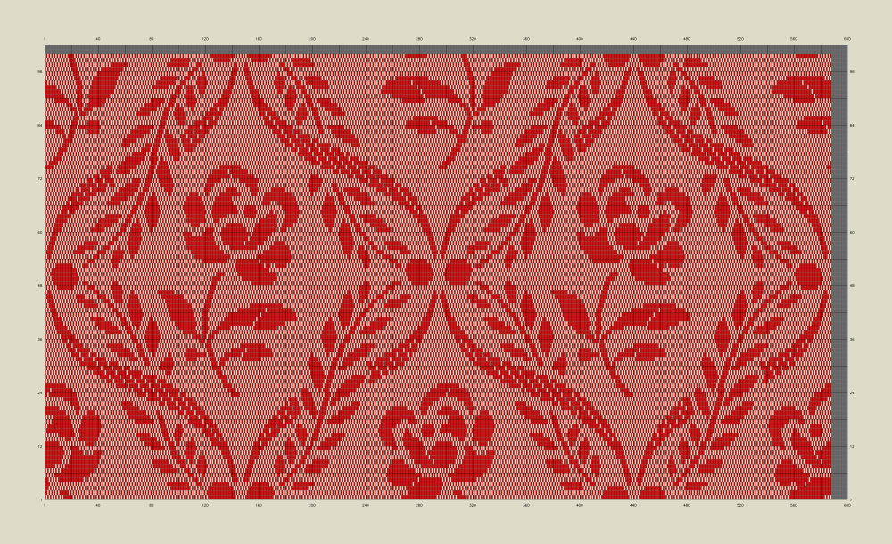

# Inhalt

## D913 - Martin Tannenhauer, 1924

- Maschine: 1760 (3 x 586 + 2)
- Platinen: 588 
- Blätter: 144
- Patrone: Schlegel & Löwenstein, Chemnitz
- Teilung: 8-18
- rot genommen

Scan: [Sachsen.digital P2009](https://sachsen.digital/werkansicht/517537/17)

## D1723 - Martin Tannenhauer, 1926

- Maschine: 1760 (2 x 880)
- Platinen: 880 
- Blätter: 136
- Patrone: Richard Grünert, Frankenberg
- Teilung: 8-20
- 1760 Fäden auf 32 cm
- 55 Schuss pro Zoll
- weiß genommen

Scan: [Sachsen.digital P1981](https://sachsen.digital/werkansicht/517533/239)

## D913 - Tannenhauer, 1978

- Maschine: 1760 (3 x 586 + 2)
- Platinen: 588 
- Blätter: 100
- Patrone: VEB Teppichweberei, Frankenberg
- Teilung: 6-20
- 55 Fäden pro cm
- 17 Schuss pro cm
- rot genommen

Scan: [Sachsen.digital P58](https://sachsen.digital/werkansicht/508550/362)

